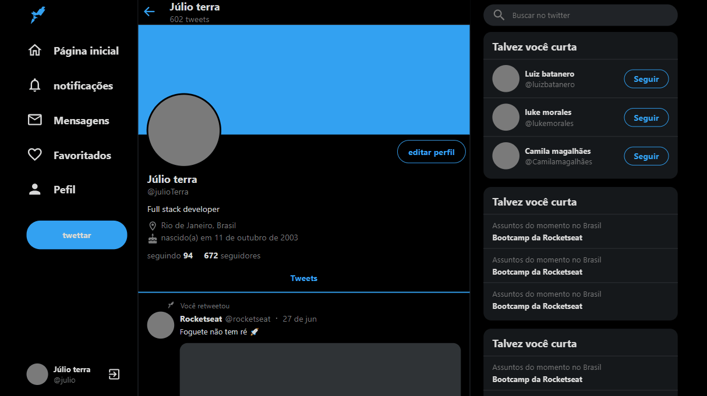
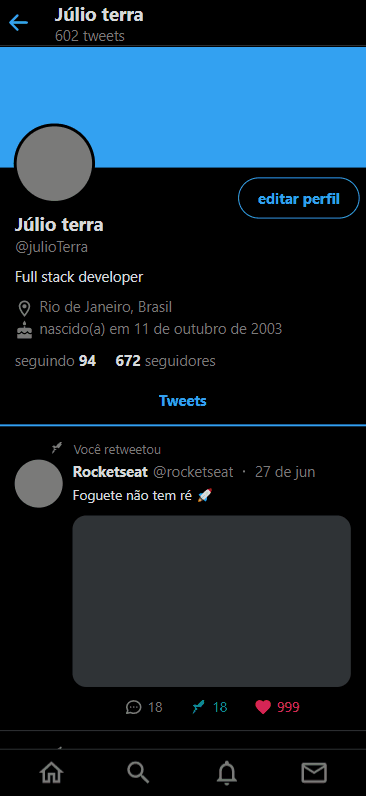

<h1 align="center">
 
Twitter-clone
</h1>

clone do Twitter feito com typescript e Reactjs

  <h1>1280x720(desktop)</h1>
  
  

  <h1>812x375(iphone-x)</h1>
  

## 🚀 Tecnologias

esse projeto foi desenvolvido com as seguintes tecnologias:

- ✔️ Typescript

- ✔️ ReactJs

- ✔️ Styled-components

- ✔️ styled-icons

- ✔️ styled-icons

- ✔️ react-sticky-box

como usar:
    acesse: <a href="https://twitter-clone-julioterra.netlify.app/">https://twitter-clone-julioterra.netlify.app/<a>
    
    ou, digite os seguites comandos:
            git clone git@github.com:julio-terra/twitter-clone.git
            cd twitter-clone
            yarn start
